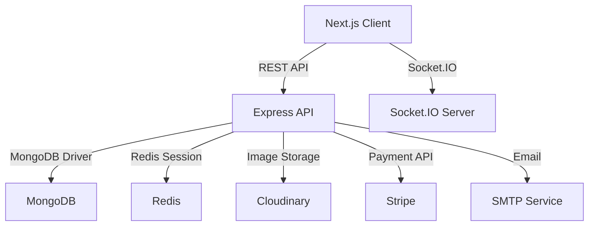
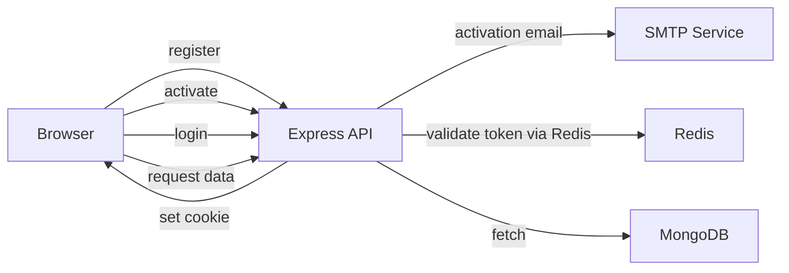
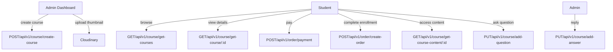
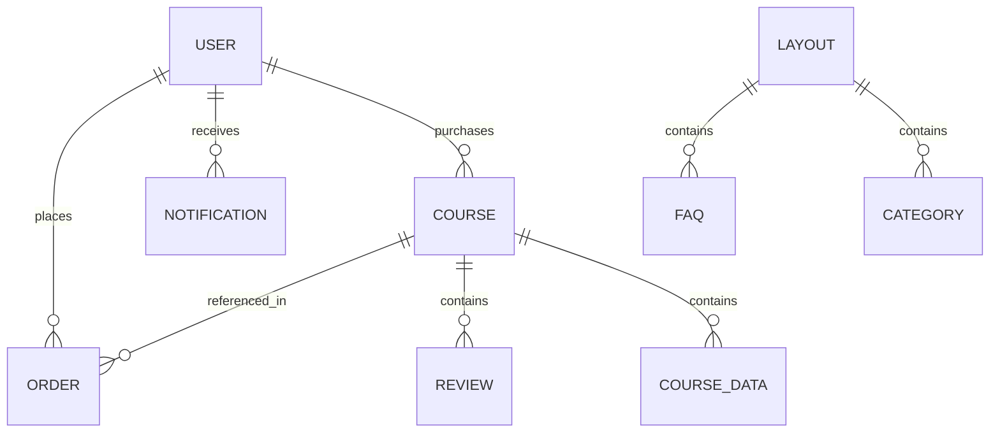

# ScholarNet LMS

> A modern Learning Management System built with Next.js, React, Redux Toolkit, Express, MongoDB, Stripe, and Redis.

## Project Overview

ScholarNet is a full-stack Learning Management System (LMS) designed to bring course discovery, purchase, and learning content delivery into a single product. The system supports:

- student enrollment and course access,
- authenticated user sessions with JWT and Redis-backed refresh tokens,
- secure payments through Stripe,
- administrative control over courses, layout, categories, FAQs, and notifications.

This platform is intended for educational organizations, course operators, and administrators who need a maintainable LMS with a responsive student experience and a centralized admin workflow.

## Problem Statement

Traditional LMS products are often costly, difficult to manage, and built around monolithic UI flows. ScholarNet solves problems such as:

- Students needing an easy way to browse courses, pay securely, and access lessons.
- Administrators needing a single panel to publish courses, manage users, and monitor analytics.
- Organizations lacking a system that combines learning content, notifications, and site layout management.

---

## Objectives

- Scalability: Separate client and API layers to scale independently.
- Maintainability: Clear folder structure and service/controller separation.
- Performance: Caching with Redis, image optimization, and client-side code splitting.
- Security: JWT, refresh tokens, role-based authorization, secure cookies, and rate limiting.
- Better learning experience: Course browsing, purchase workflow, and structured content access.
- Efficient administration: Admin panel for course, user, layout, and notifications management.

---

## Technology Stack

| Layer | Technology | Purpose |
|---|---|---|
| Frontend | Next.js | App framework, server-side rendering and routing |
| Frontend | React | UI and client logic |
| Frontend | TypeScript | Type safety |
| Frontend | Redux Toolkit RTK Query | API state management |
| Styling | Tailwind CSS | Utility-first styling |
| Auth | NextAuth | Social login providers |
| Backend | Node.js | Runtime environment |
| Backend | Express | REST API server |
| Backend | TypeScript | Server type safety |
| Database | MongoDB | Document storage via Mongoose |
| Caching | Redis | Session store and data caching |
| Media | Cloudinary | Remote image uploads for course and profile assets |
| Payments | Stripe | Payment intent and order capture |
| Email | Nodemailer + EJS | Activation and order confirmation emails |
| Real-time | Socket.IO | Notification broadcast |

---

## System Architecture



---

## Folder Structure

```text
client/
  app/           # Next.js App Router and UI pages
  components/    # Reusable UI components and admin widgets
  redux/         # Redux Toolkit configuration and API slices
  public/        # Static assets
  styles/        # shared styling utilities
server/
  controllers/   # Request handlers for business logic
  middleware/    # Auth, error handling, request guards
  models/        # Mongoose schemas
  routes/        # Express route definitions
  services/      # Reusable service functions
  utils/         # helpers, JWT, Redis, email
  mails/         # email templates
```

---

### Directory responsibilities

- `client/app` houses page-level components and layout wrappers.
- `client/components` contains student-facing and admin-facing UI blocks.
- `client/redux` contains application data fetching and auth state.
- `server/controllers` handles orchestration of request payloads, validation, and response formatting.
- `server/models` defines data shapes for users, courses, orders, notifications, and layout.
- `server/routes` wires middleware and controller handlers to endpoints.
- `server/utils` provides shared helpers for JWT, Redis, mailing, and DB connection.

---

## Key Features

### Core learning experience

- Course listing and filtering
- Course detail pages with purchase flow
- Enrolled course access and lesson playback
- Ratings, reviews, and question-answer interactions

---

### Administration

- Admin dashboard with user and course management
- Layout management (banner, categories, FAQ)
- Notification center and analytics endpoints
- Role-based access control for secure management

---

### Security and reliability

- Account registration with email activation
- JWT access + refresh token session model
- Redis session caching
- Rate limiting at API level
- Password hashing with bcrypt

---

## Authentication & Authorization

### Login flow

1. User creates an account through `/api/v1/user/registration`.
2. Server sends an activation email with a temporary token and code.
3. User activates their account at `/api/v1/user/activate-user`.
4. Login at `/api/v1/user/login` returns HTTP-only cookies and user profile.
5. Refresh tokens are validated by `/api/v1/user/refresh`.

---

### Token strategy

- Access token stored in `access_token` cookie.
- Refresh token stored in `refresh_token` cookie.
- Redis stores serialized user sessions for token validation.

---

### Roles

- `user`: student-like access, can browse courses, purchase, and view content.
- `admin`: full platform management, can create/edit/delete courses, manage users, and update layout.



---

## Course Management Workflow



---

## Student Learning Experience

Students can:

- browse courses by category,
- search courses,
- read course details and syllabus,
- initiate Stripe checkout,
- access purchased course content with token-protected routes,
- ask questions on lessons,
- review courses and receive replies.

---

## Admin Dashboard

The admin section includes:

- dashboard overview widget panels,
- course creation and edit forms,
- user management,
- layout editing for hero, categories, and FAQ sections,
- analytics charts for users, courses, and orders.

---

## Admin Panel

Admin capabilities include:

- `GET /api/v1/course/get-admin-courses`
- `POST /api/v1/course/create-course`
- `PUT /api/v1/course/update-course/:id`
- `DELETE /api/v1/course/delete-course/:id`
- `PUT /api/v1/user/update-user-role`
- `DELETE /api/v1/user/delete-user/:id`
- `GET /api/v1/notification/get-all-notifications`
- `PUT /api/v1/notification/update-notification/:id`
- `PUT /api/v1/layout/edit-layout`

---

## State Management

The client uses:

- Redux Toolkit `createApi` for server state and API caching,
- a simple `authSlice` for current user/session data,
- local React state for form and UI interactions.

This separation provides a reliable data-fetching layer while keeping page-specific state local and easy to reason about.

---

## API Design

### User endpoints

| Endpoint | Method | Purpose |
|---|---|---|
| `/api/v1/user/registration` | POST | Register and send activation email |
| `/api/v1/user/activate-user` | POST | Activate account with code |
| `/api/v1/user/login` | POST | Authenticate user and set cookies |
| `/api/v1/user/logout` | GET | Clear session cookies |
| `/api/v1/user/refresh` | GET | Refresh access token |
| `/api/v1/user/get-users` | GET | Load authenticated user profile |
| `/api/v1/user/update-user` | PUT | Update profile info |
| `/api/v1/user/update-password` | PUT | Change password |
| `/api/v1/user/update-avatar` | PUT | Update user avatar |
| `/api/v1/user/update-user-role` | PUT | Admin role update |
| `/api/v1/user/delete-user/:id` | DELETE | Admin user deletion |

---

### Course endpoints

| Endpoint | Method | Purpose |
|---|---|---|
| `/api/v1/course/create-course` | POST | Create a new course |
| `/api/v1/course/update-course/:id` | PUT | Update course data |
| `/api/v1/course/get-course/:id` | GET | Fetch public course details |
| `/api/v1/course/get-courses` | GET | Fetch all courses |
| `/api/v1/course/get-course-content/:id` | GET | Fetch purchased course content |
| `/api/v1/course/add-question` | PUT | Add question to lesson |
| `/api/v1/course/add-answer` | PUT | Add answer to question |
| `/api/v1/course/add-review/:id` | PUT | Submit course review |
| `/api/v1/course/add-reply` | PUT | Admin reply to review |
| `/api/v1/course/getVdoCipherOTP` | POST | Generate video URL token |
| `/api/v1/course/delete-course/:id` | DELETE | Remove course |

---

### Payment and order endpoints

| Endpoint | Method | Purpose |
|---|---|---|
| `/api/v1/order/create-order` | POST | Create a purchase order |
| `/api/v1/order/get-orders` | GET | Admin order list |
| `/api/v1/order/payment/stripepublishablekey` | GET | Fetch Stripe publishable key |
| `/api/v1/order/payment` | POST | Create Stripe payment intent |

---

### Layout and analytics

| Endpoint | Method | Purpose |
|---|---|---|
| `/api/v1/layout/get-layout/:type` | GET | Read layout content |
| `/api/v1/layout/edit-layout` | PUT | Update hero/faq/categories |
| `/api/v1/analytics/get-users-analytics` | GET | Admin users analytics |
| `/api/v1/analytics/get-courses-analytics` | GET | Admin courses analytics |
| `/api/v1/analytics/get-orders-analytics` | GET | Admin orders analytics |

---

### Validation and error handling

- Routes use `catchAsyncError` for promise handling.
- `ErrorHandler` normalizes API errors.
- Routes are protected with `isAuthenticated` and `authorizeRoles` middleware.
- Rate limiter prevents abuse with a 15-minute window and 100-request limit.

---

## Database Design

The server uses MongoDB with the following collections:

- `User`: stores profile, credential, role, verification state, avatar, and enrolled course IDs.
- `Course`: stores metadata, pricing, thumbnail, syllabus, reviews, and lesson-level question threads.
- `Order`: stores course purchase records, payment metadata, and buyer ID.
- `Notification`: stores admin notification history and status.
- `Layout`: stores banner, FAQ, and category content for site presentation.



---

## UI / UX Decisions

- Responsive layout using Tailwind CSS utility classes.
- Clean page structure with a shared header, footer, and hero section.
- Accessible forms and button states through consistent component patterns.
- User flows built around next/navigation routing and protected route wrappers.
- Client uses `next/image` remote patterns for Cloudinary and placeholder images.

---

## Performance Optimizations

- Server-side caching in Redis for course data and user sessions.
- Next.js image optimization with remote image sources.
- RTK Query avoids duplicate calls and caches API data.
- Conditional rendering with loaders for network states.

---

## Security Best Practices

- Password hashing through bcrypt.
- HTTP-only cookies for access and refresh tokens.
- JWT refresh flow stored in Redis.
- Rate limiting on Express routes.
- Input validation in Mongoose schemas and route controllers.
- CORS configured for `http://localhost:3000`.
- Cloudinary file upload separation for remote media.

---

## Challenges & Solutions

| Challenge | Solution | Outcome |
|---|---|---|
| Secure user sessions | JWT + Redis refresh tokens | Reduced replay risk and centralized session validation |
| Course media upload | Cloudinary integration | Media stored externally and delivered securely |
| Admin content control | layout endpoints and admin-only routes | Flexible page configuration without redeploying UI |
| Purchase flow | Stripe payment intent + order API | Secure checkout and order confirmation emails |

---

## Lessons Learned

- Strong separation between client and API simplifies maintenance.
- Redis can be used as both a session cache and validation layer.
- Admin-managed layout configuration improves flexibility for marketing and product updates.
- Next.js App Router works well with client-side state when paired with RTK Query.

---

## Future Improvements

- Add instructor role and multi-author course support.
- Deliver certificates and completion tracking.
- Add discussion forums or live chat.
- Improve learning analytics and reporting.
- Add automated tests for server routes and UI components.
- Support multi-language content and localization.

---

## Conclusion

ScholarNet is a robust LMS implementation with a split frontend/backend architecture, secure authentication, Stripe billing, Redis-backed session management, and admin-first content workflows. It demonstrates a production-minded approach to modern e-learning software and provides a solid foundation for future enhancements in analytics, collaboration, and content delivery.
